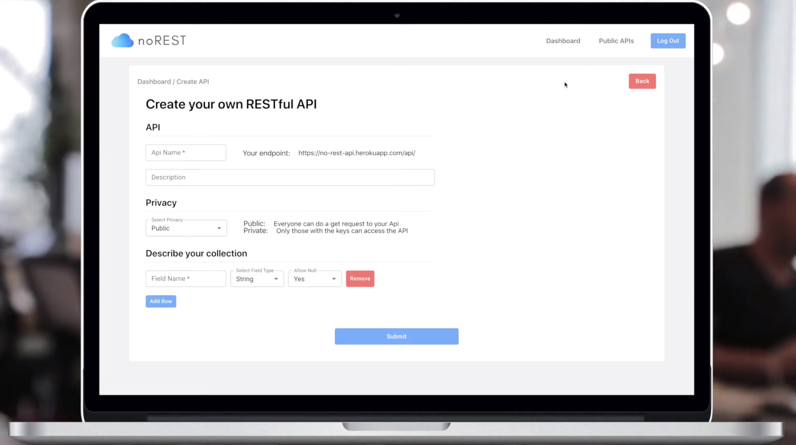

# noRest

noRest is a service platform that lets you create a comprehensive no-code API in minutes. Using our server, client's can create an exentisive database within minutes and use their personalised endpoint in their own front-end projects.

This is the back-end repository. The front end repository can be found at: https://github.com/stevelagarto/noREST-Front-End




## Getting Started

1. Clone the repository:
```
git clone https://github.com/josefrangl/noREST-Back-End
```
2. Install the dependencies:
```
npm install
```
3. Run the server with nodemon, ignoring certain folders that don't need to be watched:
```
npm run devstart
```

## Tech Stack

- [Node.js](https://nodejs.org/en/)
- [Koa.js](https://koajs.com/)
- [Mongoose](https://mongoosejs.com/)
- [MongoDB](https://www.mongodb.com/)
- [Redis](https://redis.io/)

## Contributing

We built noRest from start to finish in just 10 days.  We are aware that there is of room for improvement, so please feel free to contribute to the project.  Just fork the repository and submit a pull request.  We have a linter set up so, before committing your code make sure you run:
```
`npx gulp lint`
```
Thank you in advance!

## Team

- Steven Becker Santos - [github](https://github.com/stevelagarto) | tbc..
- Alan Douglas - [github](https://github.com/alandouglas96) | [linkedIn](https://www.linkedin.com/in/alan-douglas-aranda-824a3481/)
- Ellie Fairholm - [github](https://github.com/elliefairholm) | [linkedIn](https://www.linkedin.com/in/elliefairholm/)
- Jose Fran Garcia - [github](https://github.com/josefrangl) | [linkedIn](https://www.linkedin.com/in/josefrangl/)

## License

This projected is licensed under the MIT License.
